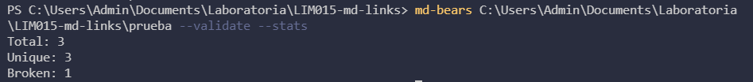

# Md-Bears ʕ•́ᴥ•̀ʔっ

## Índice

- [1. Preámbulo](#1-preámbulo)
- [2. Resumen del proyecto](#2-resumen-del-proyecto)
- [3. Diagramas de flujo](#3-diagramas-de-flujo)
- [4. Instalación](#4-instalación)
- [5. Guia de Uso](#5-guia-de-uso)

---

## 1. Preámbulo
Markdown es un lenguaje de marcado que facilita la aplicación de formato a un texto empleando una serie de caracteres de una forma especial. Es muy común encontrar archivos en este formato en cualquier tipo de repositorio, ya que normalmente contienen links que muchas veces se encuentran rotos o ya no son válidos perjudicando asi lo que se quiere compartir.

## 2. Resumen del proyecto
**Md-Bears** es una libreria creada a partir de NodeJS, la cual va a leer y analizar archivos (o directorios) en formato Markdown. Creada con el propósito de verificar el estado de los links contenidos y reportar algunas caracteristicas asi como una  herramienta de linea de comando (CLI).
## 3. Diagramas de flujo
### A P I

### C L I

## 4. Instalación

## 5.Guía de uso

### Cuando ingresas la ruta

### Cuando ingresas una ruta no válida

### Cuando ingresas una ruta que no tiene links

### Cuando ingresas una ruta válida con opcion --validate

### Cuando ingresas una ruta válida con opcion --stats

### Cuando ingresas una ruta válida con opcion --validate --stats

### Cuando ingresas una ruta válida con opcion validate mal escrito 
